# My WatchList: Movies, TV Shows and Persons

This APP integrates with TMDB API.

## Preview

<video width="300" height="648" src="docs/Demo.mp4" autoplay loop muted  type="video/mp4"></video>

## Stack

- Swift
- UIKit
- SwiftUI (integrated with UIKit using UIHostingConfiguration)

## Functionalities

- List movies and TV Shows
- Caching images and requests
- Multi-search using UICollectionViewDiffableDataSource (with smooth animations 😎)
- Login with TMDB Website(ASWebAuthenticationSession)
- Users can add to favorite and watch list
- Users can rate a movie or TV Shows
- Custom TabBarController
- Cool lottie confetti animation

## Disclaimer

This app avoids using external libraries whenever possible in order to better understand and implement native iOS APIs and architectural patterns. All UI is built programmatically, and networking, persistence, and animation are handled using Apple's frameworks directly (with a few exceptions like Lottie for enhanced UX).

## Design Pattern

The app follows the MVVM-C architecture, using delegation, dependency injection, and child view controllers to keep responsibilities clean and testable. All UIs are built programmatically with UIKit, with SwiftUI embedded where needed using UIHostingConfiguration. Async/await is used for modern concurrency.

- Programmatically UI with UIKit
- MVVM-C
- Delegate pattern
- Async/await
- Dependency Injection
- Child UIViewControllers

## Showcase

<div>
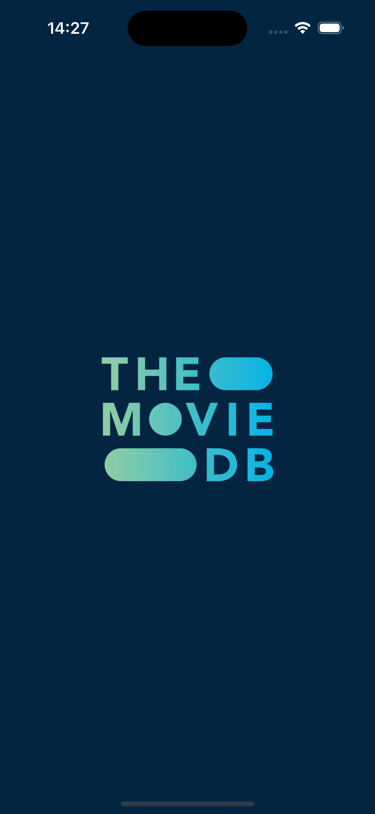
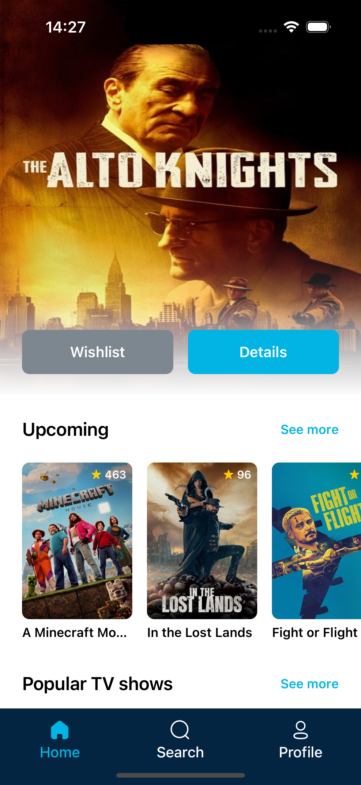
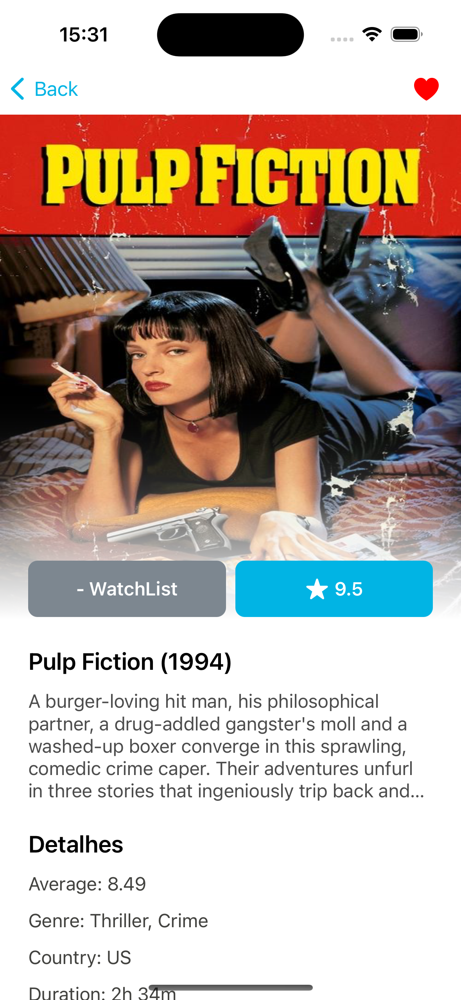
</div>

<div>
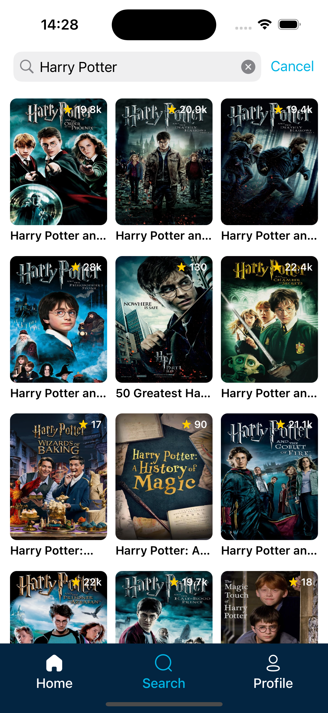
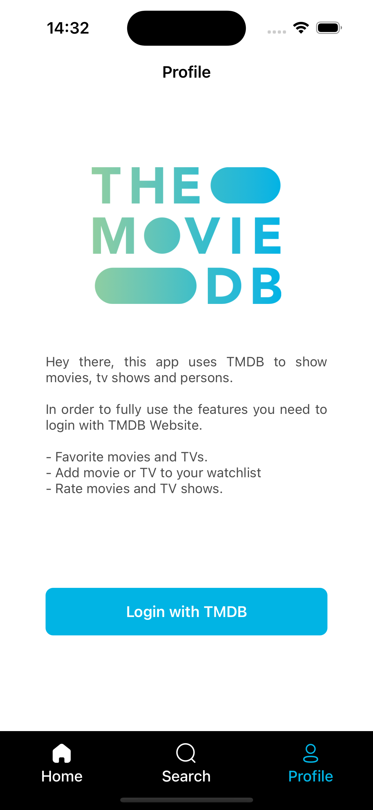
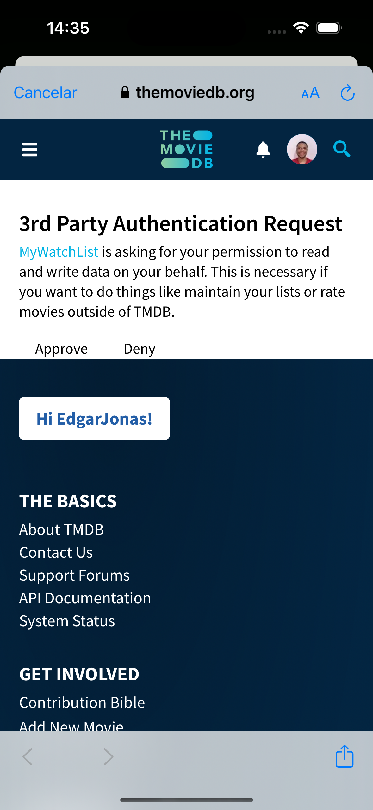
</div>

<div>
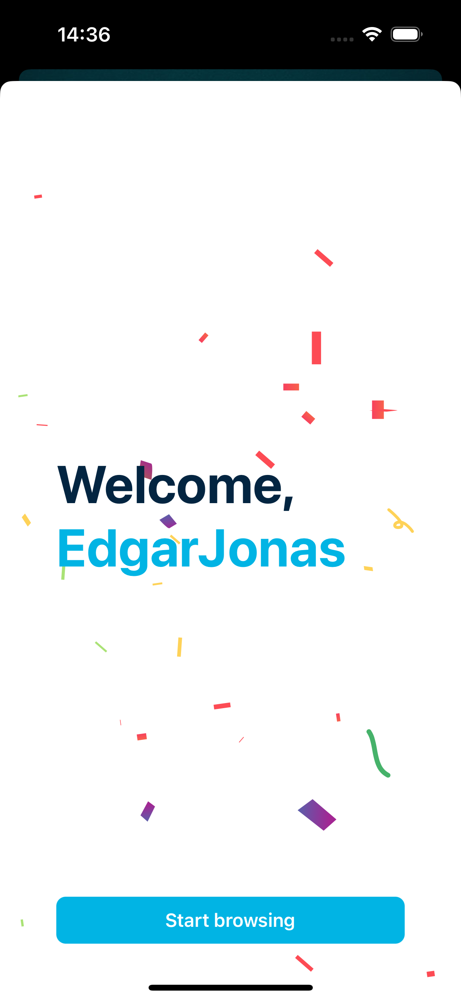
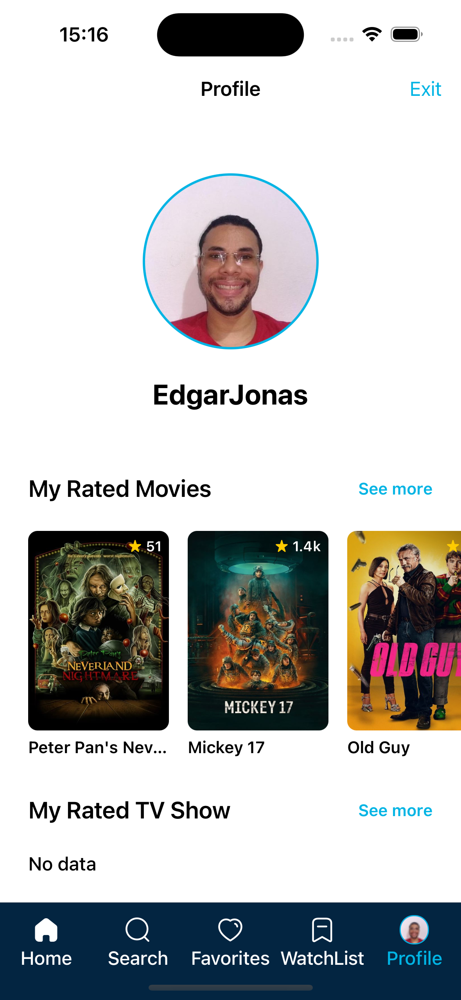
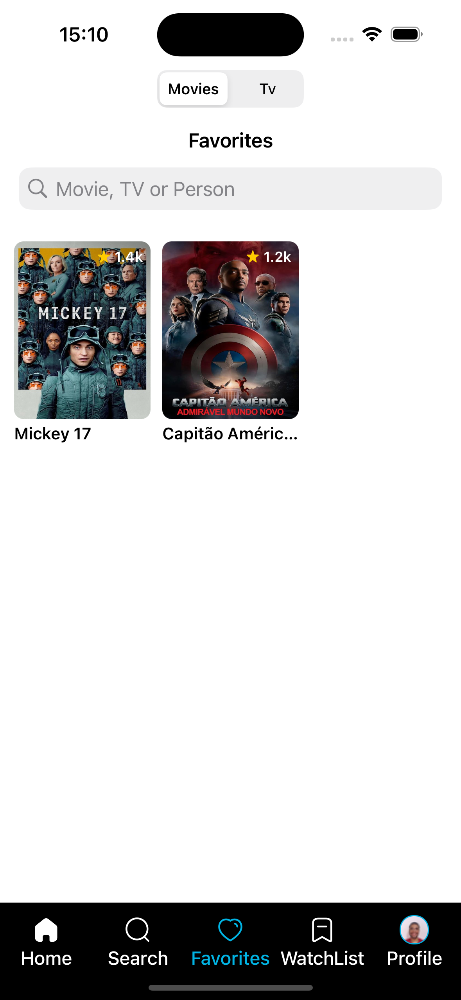
</div>

<div>
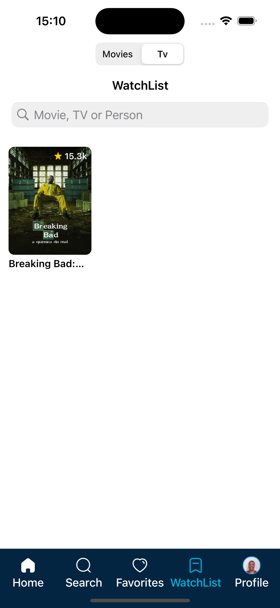
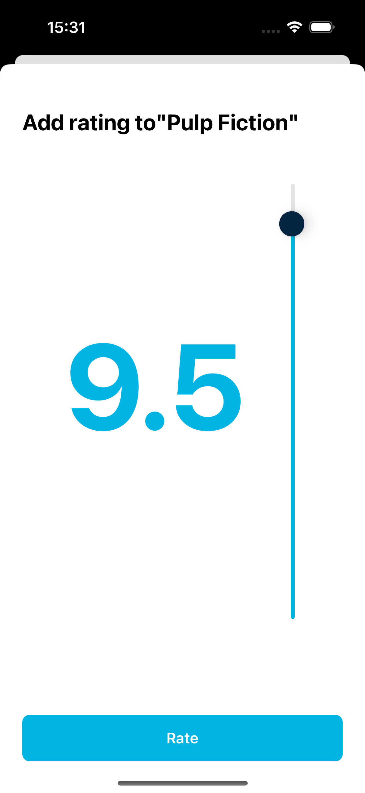
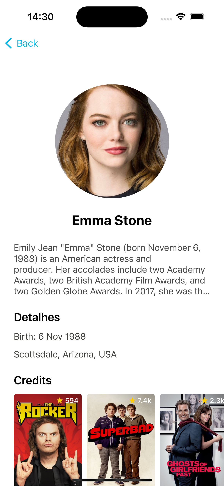
</div>

<div>
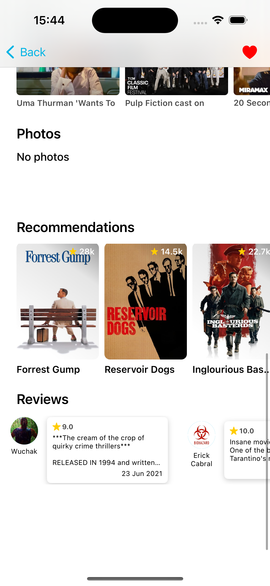
</div>

## How to run?

- git clone this repository
- Log in with TMDB Website and create a API Key
- Crate a Config.xcconfig

```
// Config.xcconfig

TMDB_API_KEY = <YOUR_API_KEY>
```

You a good to go
